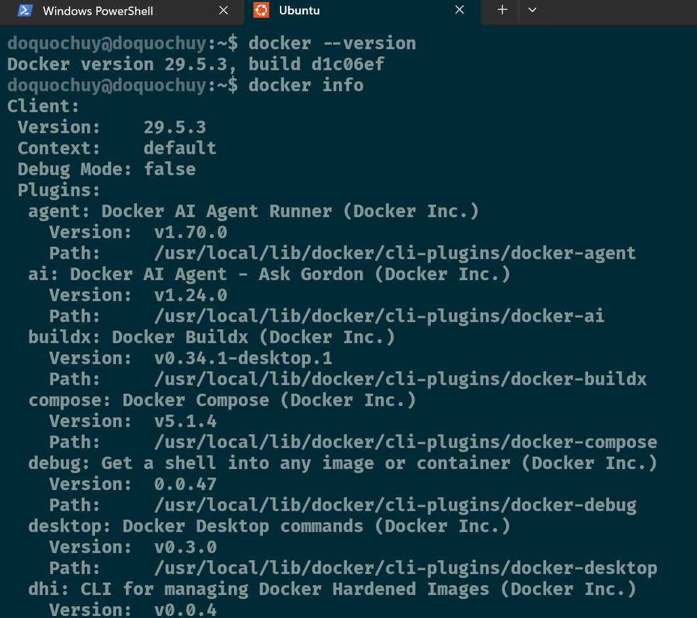
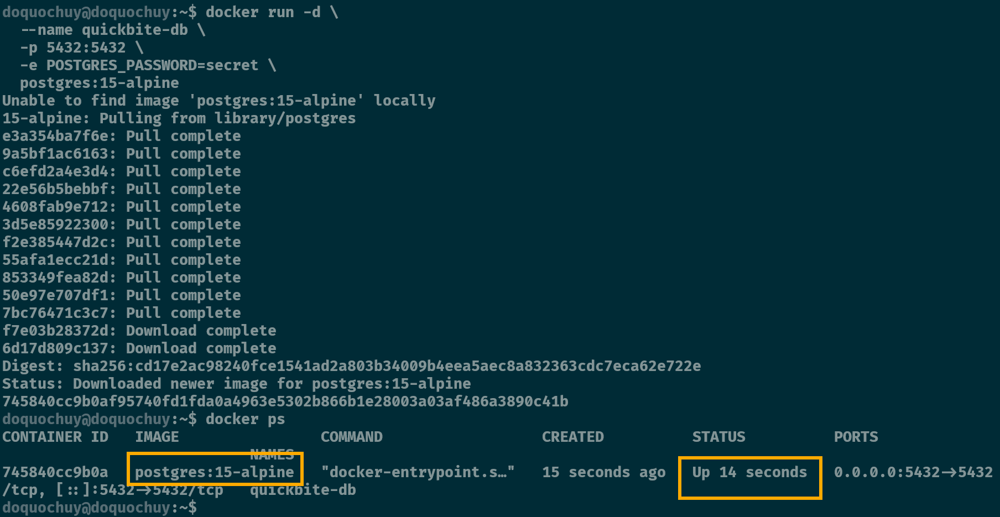
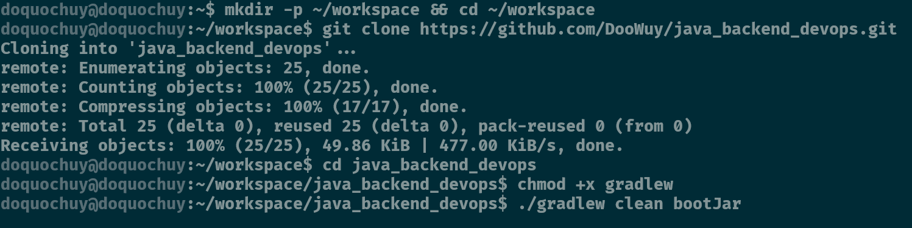
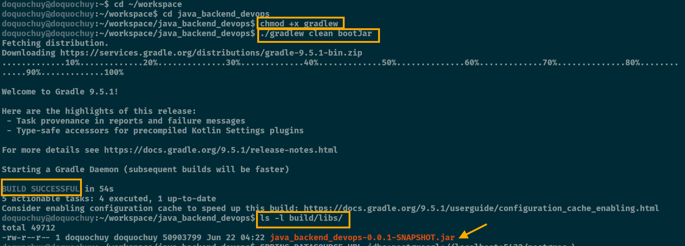
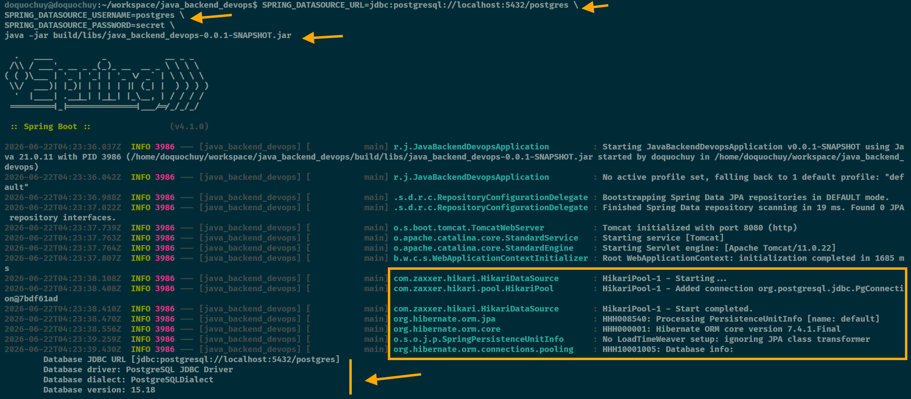
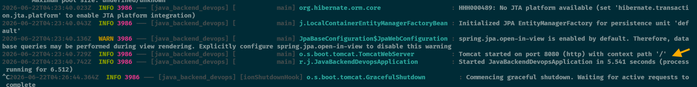

## Nhiệm vụ 1 
```bash
doquochuy@doquochuy:~$ docker --version
Docker version 29.5.3, build d1c06ef
doquochuy@doquochuy:~$ docker info
Client:
 Version:    29.5.3
 Context:    default
 Debug Mode: false


```

![[image-2.png|570]]



## **Nhiệm vụ 2: Khởi chạy Cơ sở dữ liệu bằng Docker**
```bash
doquochuy@doquochuy:~$ docker run -d \
  --name quickbite-db \
  -p 5432:5432 \
  -e POSTGRES_PASSWORD=secret \
  postgres:15-alpine
Unable to find image 'postgres:15-alpine' locally
15-alpine: Pulling from library/postgres
e3a354ba7f6e: Pull complete
9a5bf1ac6163: Pull complete
c6efd2a4e3d4: Pull complete
22e56b5bebbf: Pull complete
4608fab9e712: Pull complete
3d5e85922300: Pull complete
f2e385447d2c: Pull complete
55afa1ecc21d: Pull complete
853349fea82d: Pull complete
50e97e707df1: Pull complete
7bc76471c3c7: Pull complete
f7e03b28372d: Download complete
6d17d809c137: Download complete
Digest: sha256:cd17e2ac98240fce1541ad2a803b34009b4eea5aec8a832363cdc7eca62e722e
Status: Downloaded newer image for postgres:15-alpine
745840cc9b0af95740fd1fda0a4963e5302b866b1e28003a03af486a3890c41b
doquochuy@doquochuy:~$ docker ps
CONTAINER ID   IMAGE                COMMAND                  CREATED          STATUS          PORTS                                         NAMES
745840cc9b0a   postgres:15-alpine   "docker-entrypoint.s…"   15 seconds ago   Up 14 seconds   0.0.0.0:5432->5432/tcp, [::]:5432->5432/tcp   quickbite-db
doquochuy@doquochuy:~$

```

![[image-3.png|708]]


## **Nhiệm vụ 3: Tải Mã nguồn và Biên dịch Ứng dụng**
![[image-4.png]]


```bash
doquochuy@doquochuy:~$ cd ~/workspace
doquochuy@doquochuy:~/workspace$ cd java_backend_devops
doquochuy@doquochuy:~/workspace/java_backend_devops$ chmod +x gradlew
doquochuy@doquochuy:~/workspace/java_backend_devops$ ./gradlew clean bootJar
Fetching distribution.
Downloading https://services.gradle.org/distributions/gradle-9.5.1-bin.zip
.............10%.............20%..............30%.............40%.............50%..............60%.............70%..............80%.............90%.............100%

Welcome to Gradle 9.5.1!

Here are the highlights of this release:
 - Task provenance in reports and failure messages
 - Type-safe accessors for precompiled Kotlin Settings plugins

For more details see https://docs.gradle.org/9.5.1/release-notes.html

Starting a Gradle Daemon (subsequent builds will be faster)

BUILD SUCCESSFUL in 54s
5 actionable tasks: 4 executed, 1 up-to-date
Consider enabling configuration cache to speed up this build: https://docs.gradle.org/9.5.1/userguide/configuration_cache_enabling.html
doquochuy@doquochuy:~/workspace/java_backend_devops$ ls -l build/libs/
total 49712
-rw-r--r-- 1 doquochuy doquochuy 50903799 Jun 22 04:22 java_backend_devops-0.0.1-SNAPSHOT.jar

```

![[image-5.png]]


## **Nhiệm vụ 4: Khởi chạy và Kết nối Ứng dụng**
```bash
doquochuy@doquochuy:~/workspace/java_backend_devops$ SPRING_DATASOURCE_URL=jdbc:postgresql://localhost:5432/postgres \
SPRING_DATASOURCE_USERNAME=postgres \
SPRING_DATASOURCE_PASSWORD=secret \
java -jar build/libs/java_backend_devops-0.0.1-SNAPSHOT.jar


```

![[image-6.png]]

![[image-7.png]]

